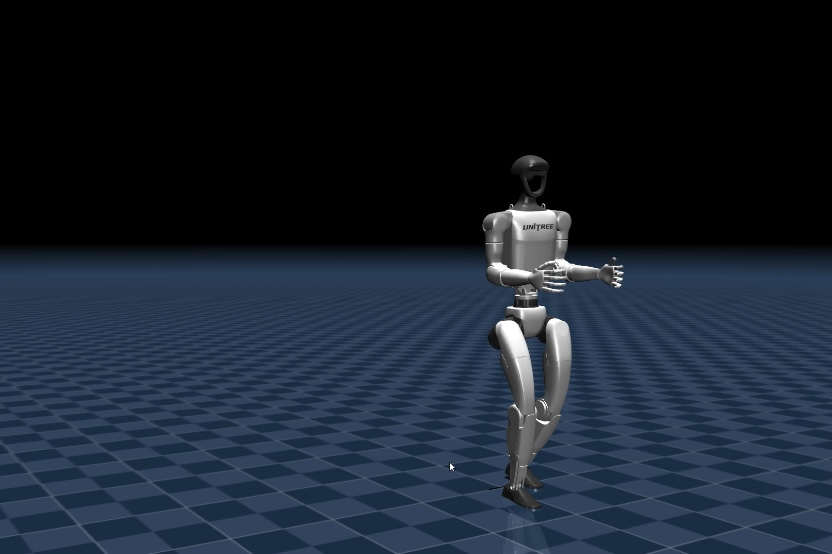
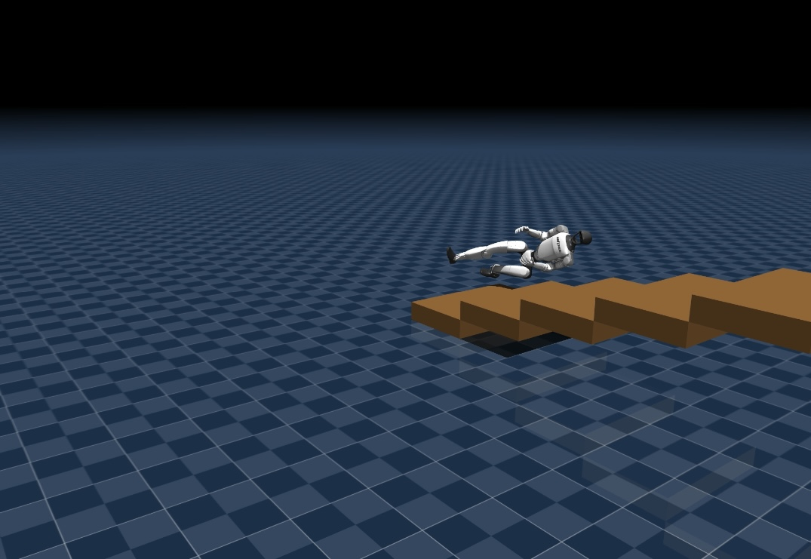
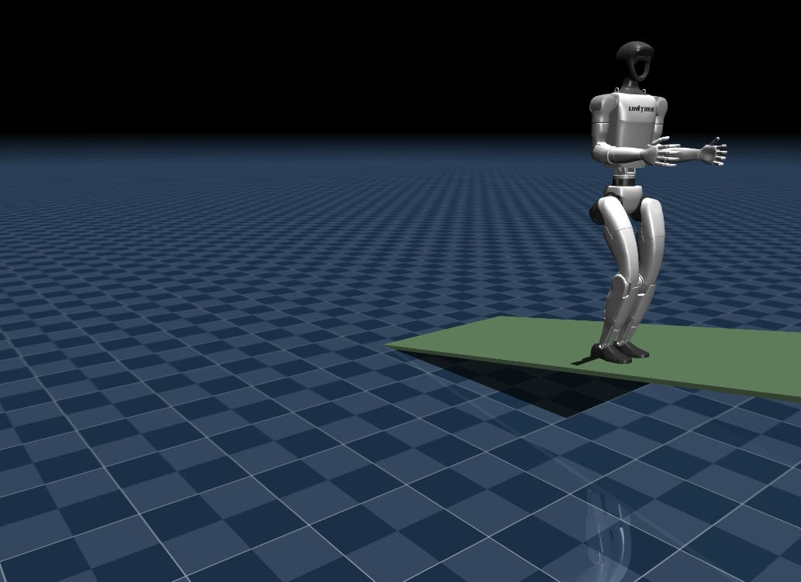
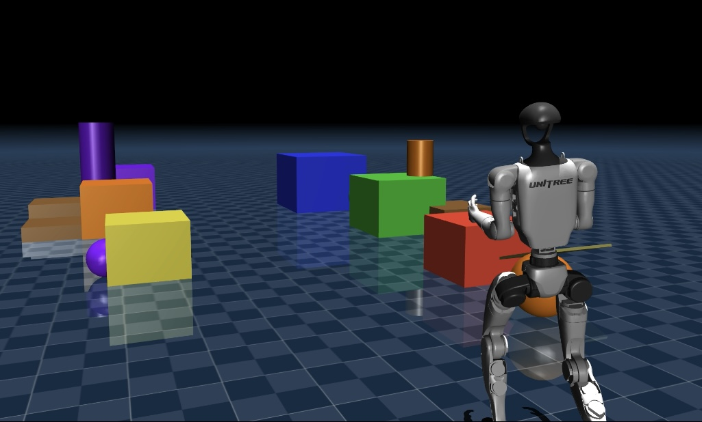
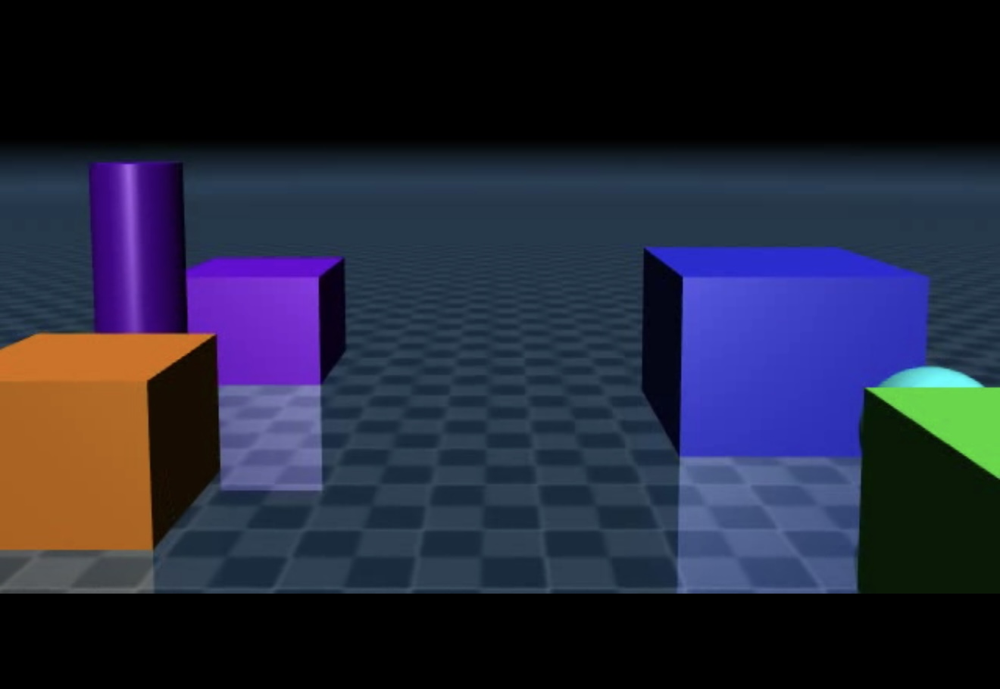

# Humanoid Learning

Evaluating a pre-trained reinforcement learning locomotion policy on the Unitree G1 humanoid in MuJoCo. The goal was to understand the limits of proprioception-only control by designing obstacle scenarios and systematically testing failure modes.


## Overview

This project loads Unitree's pre-trained G1 walking policy and evaluates it against increasingly difficult terrain scenarios. Rather than training from scratch, the focus is on behavioral evaluation — understanding what the policy can and cannot do, and why.

The core finding: the policy relies entirely on proprioception with no vision input. This explains its failure on discrete obstacles like stairs, where anticipating terrain changes is required.

## Experiments

### 1. Baseline Walk


Loaded the pre-trained policy on flat ground to establish a performance baseline. The policy produces coordinated locomotion across 12 joints simultaneously at 50Hz — fundamentally different from classical PD control which simply holds a pose.

### 2. Stairs Test


Constructed a 5-step staircase using MuJoCo XML geometry injection. The policy fails consistently on the first step — it cannot anticipate the discrete elevation change because it has no visual input. It only reacts after physical contact, which is too late for stair negotiation.

**Failure rate: ~100% on step 1**

### 3. Slope Test


Tested a 10° incline as an intermediate challenge. Unlike stairs, gradual elevation changes give the proprioceptive system more room to adapt. The policy achieves partial success — climbing most of the slope before accumulated orientation error causes instability.

**Success rate: ~40%**

### 4. Obstacle Scene & POV Camera



Added a camera to the robot's head to simulate visual perception and constructed a scene with varied obstacles. This was motivated by the stairs failure — if the policy had vision, could it anticipate terrain changes before contact?

The answer is no in the current setup: there are no open-source vision-based locomotion policies for the G1 that could consume this camera input. Training one from scratch is outside the scope of this project. The camera instrumentation serves as a proof of concept for the perception gap identified during testing.

## Key Findings

| Scenario | Outcome | Reason |
|----------|---------|--------|
| Flat ground |  Success | Policy trained on flat terrain |
| 10° slope |  Partial | Gradual change manageable |
| Stairs (15cm steps) |  Fail | Discrete elevation, no vision |

The policy uses a 47-dimensional observation vector consisting of joint positions, joint velocities, IMU orientation, angular velocity, velocity commands, and gait phase signals. No camera or depth input.

## Technical Details

- **Simulator:** MuJoCo 3.x
- **Robot:** Unitree G1 (12 actuated joints)
- **Policy:** Pre-trained TorchScript model (`motion.pt`) from unitree_rl_gym
- **Control:** RL policy at 50Hz with PD control layer at 500Hz
- **Observation space:** 47-dimensional proprioceptive vector
- **Action space:** 12 joint position targets

## Setup
```bash
# Create environment
conda create -n humanoid python=3.10 -y
conda activate humanoid

# Install dependencies
pip install -r requirements.txt

# Run baseline
python experiments/hello_humanoid.py

# Run terrain tests
python experiments/test_stairs_with_policy.py
python experiments/test_slope.py
```

## Requirements

- Unitree G1 MuJoCo model files (not included — see unitree_mujoco)
- Pre-trained policy weights (not included — see unitree_rl_gym)

## Author

Michael Nguyen

## Acknowledgements & Licenses
 
This project builds on the following open-source work from Unitree Robotics, both licensed under the **BSD 3-Clause License**:
 
**[unitree_rl_gym](https://github.com/unitreerobotics/unitree_rl_gym)**
Pretrained G1 locomotion policy and MuJoCo deployment code.
Copyright © Unitree Robotics
 
**[unitree_mujoco](https://github.com/unitreerobotics/unitree_mujoco)**
G1 MJCF robot description files and terrain generation tool.
Copyright © Unitree Robotics
 
BSD 3-Clause summary: retain copyright notice, do not use Unitree's name for promotion, disclose modifications.
Full license: [BSD-3-Clause](https://opensource.org/licenses/BSD-3-Clause)
