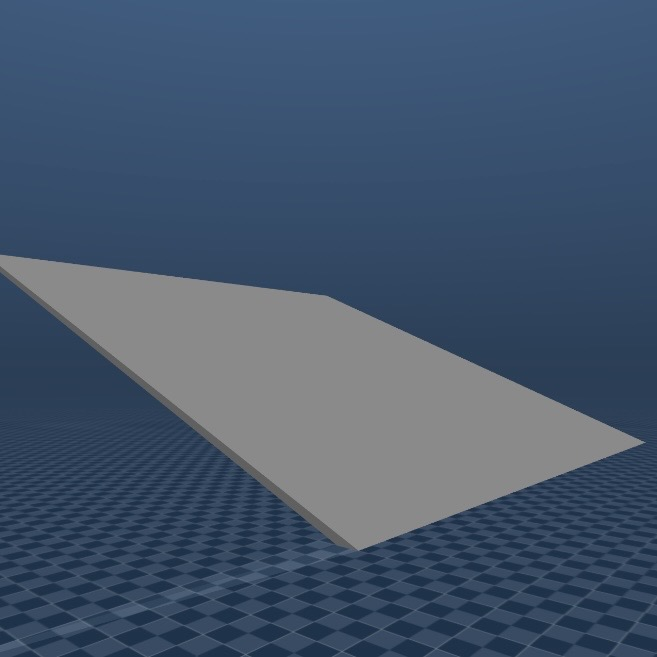
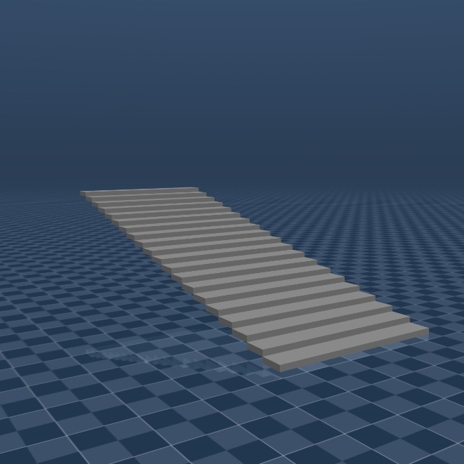
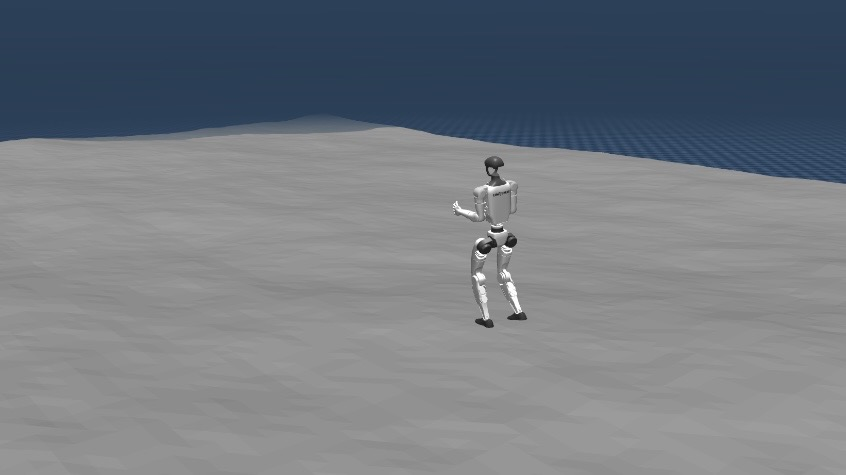
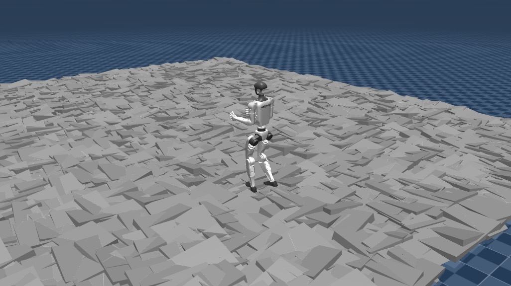
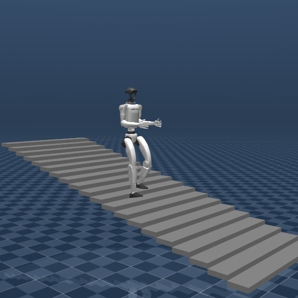

# Humanoid Simulation Evaluation
Simulation evaluation framework for the Unitree G1 humanoid robot using MuJoCo. Evaluates a pretrained locomotion policy across terrain types and movement directions, logging episode outcomes for analysis.


---
## What this does
- Runs speed sweep experiments on the G1 across flat, staircase, slope, and uneven terrain
- Tests forward, backward, and lateral movement directions
- Logs episode outcomes (fall / timeout, survival time) to CSV for analysis
- Includes an interactive sandbox for manual auditing

## Scenes
 *Steepest Slope*
#
 *Staircase*
#
 *Gentile Uneven Terrain*
#
 *Rough Uneven Terrain*
#

---

## Stack

- Python 3.10
- MuJoCo 3.x
- PyTorch (inference only)
- Apple Silicon / Mac — run with `mjpython`

---

## Structure

```
humanoid-learning/
├── run_test.py              # CLI entry point
├── eval_speed_test.py       # core sweep runner
├── sandbox.py               # interactive viewer for manual testing
├── terrain_generator.py     # generate custom terrain XMLs
├── terrain_viewer.py        # visualize terrains
├── config.py                # paths to robot model and policy
├── requirements.txt         # Python dependencies
├── environment.yml          # conda environment spec
├── scenes/                  # terrain XML files
├── results/                 # CSV output (gitignored)
└── models/                  # external repos (see Setup)
```

---

## Usage

```bash
# list available scenes
mjpython run_test.py --list

# run a sweep f,b,l are forward, backward and laterally respectively
mjpython run_test.py --scene flat --direction f 
mjpython run_test.py --scene stairs --direction b

# with viewer
mjpython run_test.py --scene slope2 --direction f --viewer

# sandbox — edit SCENE, VX, DIRECTION at top of file
mjpython sandbox.py
```

---

## Output

Each run produces one CSV in `results/` named `{scene}_{direction}.csv`:

```
episode_id, commanded_vx, direction, outcome,  survival_time_s
0,          0.2,          forward,   timeout,  10.0
1,          1.4,          forward,   fall,     3.24
```
---

## Setup

**Prerequisites:** Conda and MuJoCo 3.x installed.

1. **Clone this repo**
   ```bash
   git clone <https://github.com/your-repo/humanoid_learning.git>
   cd humanoid_learning
   ```

2. **Create and activate conda environment**
   ```bash
   conda env create -f environment.yml
   conda activate humanoid
   ```

3. **Install Python dependencies**
   ```bash
   pip install -r requirements.txt
   ```

4. **Download required models** (not included in this repo)
   ```bash
   mkdir -p models
   cd models
   git clone https://github.com/unitreerobotics/unitree_rl_gym.git
   git clone https://github.com/unitreerobotics/unitree_mujoco.git
   cd ..
   ```

5. **Verify paths in `config.py`**
   - Update `UNITREE_RL_GYM_PATH` and `UNITREE_MUJOCO_PATH` if models are stored elsewhere.

---


## Acknowledgements & Licenses

This project builds on the following open-source work from Unitree Robotics, both licensed under the **BSD 3-Clause License**:

**[unitree_rl_gym](https://github.com/unitreerobotics/unitree_rl_gym)**
Pretrained G1 locomotion policy and MuJoCo deployment code.
Copyright © Unitree Robotics

**[unitree_mujoco](https://github.com/unitreerobotics/unitree_mujoco)**
G1 MJCF robot description files and terrain generation tool.
Copyright © Unitree Robotics

BSD 3-Clause summary: retain copyright notice, do not use Unitree's name for promotion, disclose modifications.
Full license: [BSD-3-Clause](https://opensource.org/licenses/BSD-3-Clause)